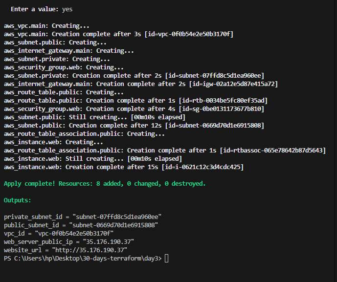
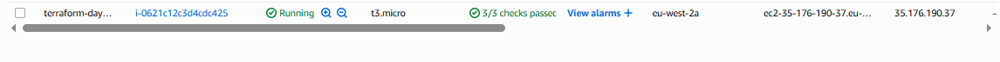
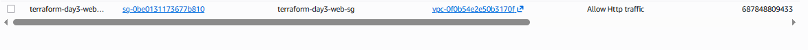
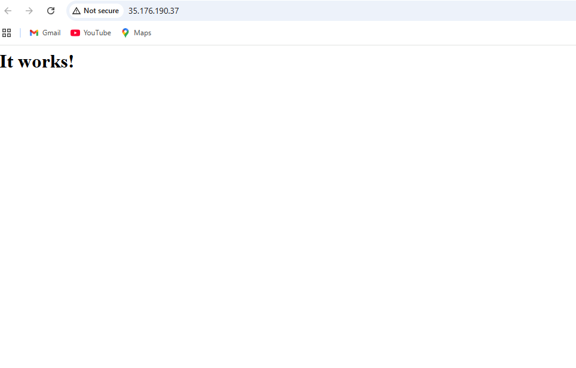
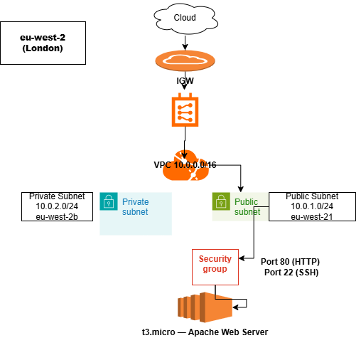

# Day 3 — Deploying My First Server with Terraform

## What I Built
A complete AWS web server infrastructure deployed entirely using 
Terraform code. No clicking in the AWS console — one command 
created everything.

## Live Server
**IP:** 35.176.190.37  
**URL:** http://35.176.190.37  
**Result:** Apache web server running — "It works!"

## Architecture
```
Internet
    ↓
Internet Gateway (igw-02a12e5d87e415a72)
    ↓
Route Table → Public Subnet (10.0.1.0/24) — eu-west-2a
    ↓
Security Group (port 80 + port 22 open)
    ↓
EC2 t3.micro (i-0621c12c3d4cdc425)
    ↓
Apache Web Server

Private Subnet (10.0.2.0/24) — eu-west-2b (no internet access)

All inside VPC (10.0.0.0/16) — eu-west-2 London
```

## Resources Created (8 total)
| Resource | Name | ID |
|---|---|---|
| VPC | terraform-day3-vpc | vpc-0f0b54e2e50b3170f |
| Public Subnet | terraform-day3-public-subnet | subnet-0669d70d1e6915808 |
| Private Subnet | terraform-day3-private-subnet | subnet-07ffd8c5d1ea960ee |
| Internet Gateway | terraform-day3-igw | igw-02a12e5d87e415a72 |
| Route Table | terraform-day3-public-rt | rtb-0034be5fc80ef35ad |
| Route Table Association | — | rtbassoc-065e78642b87d5643 |
| Security Group | terraform-day3-web-sg | sg-0be0131173677b810 |
| EC2 Instance | terraform-day3-web-server | i-0621c12c3d4cdc425 |

## File Structure
```
day3/
├── main.tf         # All resources
├── variables.tf    # Input variables
├── outputs.tf      # Output values
└── README.md       # This file
```


## Terraform Workflow
```bash
terraform init    # Downloaded AWS provider v6.37.0
terraform plan    # Showed 8 resources to create
terraform apply   # Created all 8 resources in correct order
terraform destroy # Cleaned up all resources after testing
```

## Key Concepts Learned

**Provider block** configures the cloud platform. It tells Terraform 
where to deploy — which cloud and which region. Without it Terraform 
has no target. On terraform init it downloads the provider plugin.

**Resource block** defines infrastructure to create. Pattern is always:
resource "type" "local_name" { arguments }
The local name is used to reference the resource elsewhere in code.

**Resource references** like aws_vpc.main.id link resources together.
Terraform reads these references, builds a dependency graph, and 
creates resources in the correct order automatically. You never 
write depends_on manually.

**terraform plan** is a dry run. It reads your code, compares against 
the state file, queries AWS, and shows exactly what will change — 
with + for creates, ~ for updates, - for destroys. Nothing changes 
in AWS during plan. Always read it before apply.

**Nested blocks vs arguments** — arguments use = sign. Nested blocks 
like route { } and ingress { } never use = sign. This was one of 
my first errors — writing route = { } caused a type error.

**State file** tracks everything Terraform created. When apply fails 
midway the state file records what succeeded. Destroy uses the state 
file to know exactly what to clean up.

## Challenges Faced

**route = { } syntax error**
Used equals sign on the route nested block. Terraform threw 
"set of object required" error. Fix: removed the = sign.
Nested blocks never use = in HCL.

**t2.micro not eligible in eu-west-2**
AWS rejected t2.micro with InvalidParameterCombination error.
t3.micro is the correct free tier instance type for London region.

**Security group dependency violation on destroy**
Lingering network interface from failed apply blocked SG deletion.
Fixed by manually deleting the ENI in EC2 console then destroying.

## Screenshots





## Architecture Diagram

